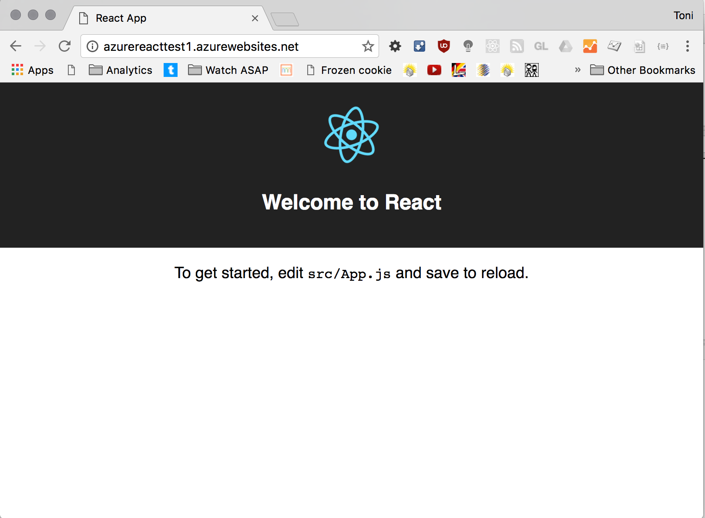

# React-Image-Slider-Tutorial
Learn about how I made my React Image Slider. Mini-course below!

## Tools Used :wrench: :nut_and_bolt:
- [Atom](https://atom.io/)
- [platformio-ide-terminal](https://atom.io/packages/platformio-ide-terminal)
- [Node.js](https://nodejs.org/en/) (assumed it is installed on your machine in these instructions)


# :zap: Make Your Own React Image Slider :zap:

## Setting Up Your Project :octocat: :wrench:

<!-- - [Clone this project](https://help.github.com/en/github/creating-cloning-and-archiving-repositories/cloning-a-repository) onto your own machine. -->

- Locate the folder where you want the project to live on your machine in the terminal.
  - If you have [platformio-ide-terminal](https://atom.io/packages/platformio-ide-terminal) installed in [Atom](https://atom.io/): open a project folder in an Atom window and open your terminal in the editor. You should see your name and project name on the line you are typing on.
  - If you do not have it and would not like to download it, then navigate to your folder in your machine's [built in terminal/shell](https://www.macworld.com/article/2042378/master-the-command-line-navigating-files-and-folders.html).


- Now that you are in the correct folder in the terminal, enter this command `npx create-react-app react`. This will create a new project folder that has the React framework in it.

- `cd` into new directory

- enter `npm start` in the terminal
- you should be seeing a sample react page something like this:


- ### Delete the following :no_good:
  - `apps-test.js`

  - `serviceWorker.js`

  - `App.test.js`

  - `public/logo.svg`

  - In `index.js` delete the following lines of code:
    - `import * as serviceWorker from './serviceWorker';`
    - ```
// If you want your app to work offline and load faster, you can change
// unregister() to register() below. Note this comes with some pitfalls.
// Learn more about service workers: https://bit.ly/CRA-PWA
serviceWorker.unregister();```


- ### Create the following :nut_and_bolt:
  - In the `src` folder, add two folders:
    - `components`

    - `data`

  - Inside `components` create the following files:
    - `ImageSlider.jsx`

    - `ImageSlider.css`

    - Move `App.css` into this folder

    - Move `App.js` into this folder and rename it to `App.jsx` (This is more accurate as this is the language/semantics we will be using)

  - Inside `data` create the following files:

    - `images.js`

    - Your file structure should look like:
    ```
    src
    |
    |--components
    |    |
    |    |--App.css
    |    |--App.jsx
    |    |--ImageSlider.css
    |    |--ImageSlider.jsx
    |
    |--data
    |    |--images.js
    |
    |--index.js
    |--index.css
    ```
    The rest of the files should remain in the same location/naming.
